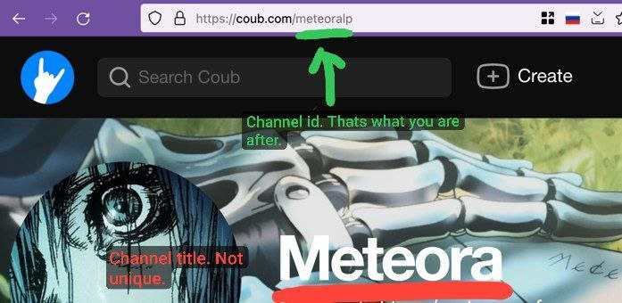

# jforwarder

    
[](http://hits.dwyl.com/dankoy/jforwarder)

# Trademark disclaimer

Coub and the Coub logo are trademarks of Coub.com Ltd and its affiliates. All rights reserved.    
Coubs are property of Coub.com Ltd and their respective owners.    
I do not own anything affiliated with Coub.com.

## Bot link

https://t.me/coub_forwarder_bot

# Purpose

The reason for creation of this project is to have access to coubs in telegram private or group
chats. Without registration and sms.

# Features

1) Subscription on channel
2) Subscription on tag
3) Subscription on community

## Usage

User can subscribe to different coub communities and sections, by tags or directly to channels in
telegram bot. Then periodically bot will send new coubs to subscribed user. Bot sends only coubs
that has been published after last sent coub to chat.

### Example of making community subscription

1) To get all available communities and its sections:
   ```/communities```

   > Available communities:    
   community: animals-pets    
   sections: monthly, quarter, half, daily, fresh, rising, weekly    
   ... truncated ...

2) To subscribe to community or tag:    
   ```/subscribe community animals-pets weekly```    
   ```/subscribe tag cars popular```
   ```/subscribe channel meteoralp most_recent```

3) Bot will periodically send links to coubs for every subscription user has.

   Example of message:
   > community #animals-pets #weekly    
   https://coub.com/view/3ca3fu

4) Show user active subscriptions: ```/my_subscriptions```
   > Community subscriptions:    
   1: animals-pets weekly

## Where to find channel identification?

Open coub channel in browser. Find the last word in URL. Use it.



## Stack

1. Spring boot 3.2.2
2. PostgreSQL
3. Flyway
4. Spring Cloud Netflix Eureka
5. Spring Cloud Loadbalancer
6. Spring Cloud Gateway
7. Open feign
8. Caffeine Cache
9. Micrometer tracing
10. Zipkin reporter brave
11. Zipkin
12. Docker compose
13. Telegrambots 6.9.7.0
14. Java 21

## Monitoring stack

1. Prometheus
2. Grafana
3. Prometheus node exporter
4. Prometheus postgres exporter

## Microservice architecture

Microservice communication schema:    


Microservice monitoring schema:    


## Build

Create .env file with secret variables

```
JASYPT_MASTER_PASSWORD=pass
POSTGRES_CONTAINER_PASSWORD=pass
POSTGRES_CONTAINER_DB=db
POSTGRES_CONTAINER_USER=user
POSTGRES_CONTAINER_URL=jdbc:postgresql://container_name:port/db
TELEGRAM_BOT_NAME=name
TELEGRAM_BOT_API_TOKEN=token
JAR_VERSION=x.x.x-SNAPSHOT
DOCKER_HUB_USER=user
```

Variable **JAR_VERSION** is used only when building through command line docker compose build or
docker build

**JAR_VERSION** in has to be equal the project version in **build.gradle** file in root folder

#### Build using docker compose command line

Builds every microservice

```shell
docker compose build 
```

#### Build using docker buildx command line

Have to run this command for every dockerfile manually

```shell
docker buildx build --platform linux/amd64,linux/arm64 --build-arg JAR_VERSION=x.x.x-SNAPSHOT -f .\Dockerfile.{microservice}:x.x.x-SNAPSHOT .
```

#### Run compose

```shell
docker compose up -d
```

### Monitoring

For monitoring created new docker compose project [monitoring](/monitoring)

#### Add .env file in monitoring folder

```
POSTGRES_CONTAINER_PASSWORD=password
POSTGRES_CONTAINER_USER=user
DATA_SOURCE_NAME="postgresql://${POSTGRES_CONTAINER_USER}:${POSTGRES_CONTAINER_PASSWORD}@<container-name>:<port>/?sslmode=disable"
GF_SECURITY_ADMIN_USER=user
GF_SECURITY_ADMIN_PASSWORD=password
```

#### Run monitoring

```shell
cd monitoring && docker compose up -d
```