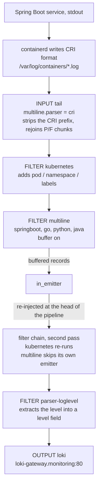

# Fluent Bit log pipeline

How a line printed by a Spring Boot service ends up in Loki as a single
record, and why this directory is configured the way it is.

Files:

| File | What it is |
| --- | --- |
| [fluent-operator.yaml](fluent-operator.yaml) | Helm values for the `fluent/fluent-operator` chart |
| [multiline-parser-springboot.yaml](multiline-parser-springboot.yaml) | Custom `ClusterMultilineParser`, applied separately |
| [loglevel-filter.yaml](loglevel-filter.yaml) | `ClusterParser` + `ClusterFilter` putting the level into a `level` field |
| `*.yaml_DISABLED` | Earlier hand written manifests, kept for reference |

## Overview



Two separate stages do multiline work, and they are not interchangeable:

1. **tail input, parser `cri`** — transport layer. Undoes what containerd did
   to the stream.
2. **multiline filter, parser `springboot`** — application layer. Joins a log
   event with its stacktrace.

## How the config is generated

The chart does not ship a `fluent-bit.conf`. It renders CRs — `ClusterInput`,
`ClusterFilter`, `ClusterOutput`, `ClusterMultilineParser` — and the operator
assembles the actual config for the DaemonSet from them.

One consequence matters a lot here. Filters are ordered in
[`ClusterFilterList.Load()`](https://github.com/fluent/fluent-operator/blob/master/apis/fluentbit/v1alpha2/clusterfilter_types.go)
by `sort.Sort(FilterByOrdinalAndName(...))`: by the `ordinal` field, and for
equal ordinals **by name**. The chart never sets `ordinal`, so the pipeline
order is purely alphabetical:

```
containerd  <  kubernetes  <  multiline  <  systemd
```

There is no way to reorder them from values — the chart templates do not
render `ordinal` at all. Several decisions below exist because of this.

## Stage 1: what is actually in the log file

A container runtime does not write raw stdout. containerd wraps every line:

```
2026-09-03T10:00:01.456789Z stdout F java.lang.IllegalStateException: coub queue is empty
└────────── time ─────────┘ └stream┘ │ └──────────────── payload ────────────────────┘
                                     └─ logtag: F = Full, P = Partial
```

`logtag` is the chunking mechanism: containerd splits anything longer than
16KB into `P`, `P`, …, final `F`. Long stacktraces hit this regularly.

The docker runtime writes something completely different — JSON, one object
per line: `{"log":"...","stream":"stdout","time":"..."}`.

That is what `containerRuntime` in the values selects. k3d is k3s running
inside a docker container, but **the nodes themselves run containerd**, so the
format is CRI. It must stay `containerd`.

> With `containerRuntime: docker` the tail parser fails on every line. When
> the parser fails, tail falls back to putting the whole raw line into `log`,
> CRI prefix included. No stacktrace continuation rule such as
> `/^[\t ]+at /` can then match, because the line starts with a date rather
> than a tab. This was the original reason multiline never worked.

`containerRuntime` also feeds `CONTAINER_LOG_PATH` for the operator through
the `fluent-operator.containerLogPath` helper: `/var/lib/docker/containers`
for docker, `/var/log/containers` otherwise. On k3s the docker path does not
exist.

## Stage 2: tail and the `cri` parser

```yaml
multilineParser: "cri"
```

The built-in `cri` is not an ordinary parser but a multiline parser of type
`FLB_ML_EQ`
([`flb_ml_parser_cri.c`](https://github.com/fluent/fluent-bit/blob/master/src/multiline/flb_ml_parser_cri.c)):

```c
"cri", FLB_ML_EQ, "F",   /* type: equality, wait for the value "F" */
"log",                   /* key_content — where the payload goes   */
"stream",                /* key_group   — separate stdout / stderr */
"_p",                    /* key_pattern — the field holding logtag */
```

Read it as: keep concatenating the payload until `_p` equals `"F"`, then
flush. So it **strips the CRI prefix into a clean `log` key** and
**reassembles the 16KB chunks** in one pass.

Why not the plain `parser: cri`? Two reasons. It puts the text into
`message`, not `log` — which is exactly why the chart needs a lua filter to
rename it. And it knows nothing about `P`/`F`. The two are mutually
exclusive anyway, see
[`tail_file.c`](https://github.com/fluent/fluent-bit/blob/master/plugins/in_tail/tail_file.c):

```c
if (ctx->ml_ctx) {
    ret = flb_ml_append_text(...);
    goto go_next;              /* the regular parser is skipped entirely */
}
else if (ctx->docker_mode) { ... }
```

## Stage 3: why the containerd lua filter is disabled

This is the least obvious part.

In buffered mode the multiline filter does not return records in place. It
accumulates them and **re-emits them through the internal `in_emitter` input
at the head of the pipeline**, so they traverse the filter chain a second
time.

The multiline filter guards itself against this
([`ml.c`](https://github.com/fluent/fluent-bit/blob/master/plugins/filter_multiline/ml.c)):

```c
if (i_ins == ctx->ins_emitter) {
    return FLB_FILTER_NOTOUCH;   /* do not process records from the emitter */
}
```

The lua filter has no such guard, and it sorts first alphabetically. Its body:

```lua
if record["logtag"] ~= nil then
    record["log"] = record["message"]
    record["message"] = nil
end
```

First pass: `message` moves into `log`, `message` is removed. `logtag`
survives. Second pass over a concatenated record: the condition is true
again, so `record["log"] = record["message"]` with `message` already `nil` —
and assigning `nil` in lua deletes the key. **The concatenated stacktrace is
wiped.**

This never fired before only because `containerRuntime: docker` meant
`logtag` was never produced and the lua was a no-op. Switching to containerd
would have armed it. Since `multilineParser: "cri"` makes the
`message` -> `log` rename unnecessary in the first place, the filter is
simply off.

## Stage 4: the multiline filter

```yaml
buffer: true
emitterMemBufLimit: 20      # the operator renders this as "20MB"
flushMs: 2000
```

`buffer: false` was **not what it looked like**. In
[`multiline_types.go`](https://github.com/fluent/fluent-operator/blob/master/apis/fluentbit/v1alpha2/plugins/filter/multiline_types.go):

```go
if m.Buffer { kvs.Insert("buffer", fmt.Sprint(m.Buffer)) }
```

On `false` the property is not written at all, and fluent-bit's own default
is `"true"`. Buffering was already on; the config just lied about it. It is
now explicit, because the alternative is genuinely bad: unbuffered mode calls
`flb_ml_flush_pending_now()` at the end of **every** chunk and ignores
`flushMs`, so a stacktrace landing on the boundary between two reads of the
file is emitted as two records.

`emitterMemBufLimit` is in MB. It was `120` -> `120MB`, on top of tail's
`memBufLimit: 100MB`, against a container limit of `200Mi`. The pod would be
OOMKilled — which loses logs at exactly the moment they are wanted. Now `20`
and `50MB`.

## Stage 5: the `springboot` parser

A multiline parser is a state machine. Rules are triples of
`(from state, regex, to state)`; the traversal logic lives in
[`flb_ml_rule_process()`](https://github.com/fluent/fluent-bit/blob/master/src/multiline/flb_ml_rule.c):

1. if the stream is already in some state, try the rules reachable from it,
   **skipping start rules**; the first match appends the line;
2. otherwise try the start rules (`try_start_state`); on a match, flush the
   previous record and begin a new one;
3. if nothing matches, return `-1`, which tells the caller to flush whatever
   is pending and emit this line as a standalone record.

### Why the built-in `java` parser is not enough

It builds its automaton around the word "Exception". The start rule is
`/(.)(?:Exception|Error|Throwable)[:\r\n]/` — a class name followed by a
colon. Two gaps follow from that:

- the logger line `... ERROR ... CoubService : Failed to send coub` does not
  qualify (`ERROR` in caps is not `Error`), so it is detached from its own
  stacktrace;
- `throw new BotException()` with no message prints as
  `ru.dankoy...BotException` without a colon, the start rule never fires, and
  every `at ...` frame becomes its own record.

### What we use instead

The custom parser anchors on the shape of the line rather than on a keyword:

```
start_state  /^\d{4}-\d{2}-\d{2}T\d{2}:\d{2}:\d{2}\.\d{3}/     → cont
cont         /^(?!\d{4}-\d{2}-\d{2}T\d{2}:\d{2}:\d{2}\.\d{3})/ → cont
```

**A line starting with a timestamp opens a new event; everything else belongs
to the previous one.** The format is `yyyy-MM-dd'T'HH:mm:ss.SSSXXX` from
`CONSOLE_LOG_PATTERN` in Spring Boot's logback
[defaults.xml](https://github.com/spring-projects/spring-boot/blob/v4.1.0/core/spring-boot/src/main/resources/org/springframework/boot/logging/logback/defaults.xml).
No service overrides it — only `logging.pattern.correlation` is customised.

This works because `%wEx`
(`ExtendedWhitespaceThrowableProxyConverter`) prints the stacktrace wrapped in
blank lines, and no line of a trace carries a timestamp:

```
2026-09-03T10:00:01.456+03:00 ERROR ... CoubService : Failed to send coub   ← start
                                                                            ← cont
ru.dankoy.telegrambot.core.exception.BotException: chat not found           ← cont
	at ru.dankoy.telegrambot.core.service.CoubService.send(...)              ← cont
Caused by: feign.FeignException$NotFound: [404] during [GET] to [...]       ← cont
	... 12 common frames omitted                                            ← cont
                                                                            ← cont
2026-09-03T10:00:02.001+03:00  INFO ... CoubService : Retrying              ← new start,
                                                                              previous flushed
```

The negative lookahead is safe: fluent-bit builds Onigmo with
`ONIG_SYNTAX_RUBY` (`src/flb_regex.c`).

### Parser order

```yaml
parsers:
  - springboot
  - go
  - python
  - java
```

All four go into a single group (`flb_ml_group_add_parser`) and are tried in
list order — the first automaton that accepts the line owns the stream. Our
services match `springboot`. For kafka/strimzi (log4j prints
`2026-09-03 10:00:00,123`, a space instead of `T`), postgres and Go workloads
the start rule does not match, the parser returns `-1`, and the next one in
the list gets a turn. That is why `java` is still there: it covers exactly
the cases `springboot` declines.

The trade-off is latency. A record is held until the next log line arrives or
`flushTimeout` (1s) expires — the end of an event is only knowable once the
next one begins.

### Why `"cri, java"` in the tail input does not work

A fair question, since tail's `multiline.parser` accepts a list. Same
traversal logic: `cri` matches **every** CRI line, so it always wins and
`java` never gets control. The split is mandatory — `cri` in the input peels
off the transport layer, `springboot` in the filter parses the application
one.

## Log levels

Loki attaches `detected_level` to every entry on ingestion. Its detector reads a
level field out of the JSON line first and only falls back to scanning raw text
when it finds none. The loki output ships the whole record as JSON, so
[loglevel-filter.yaml](loglevel-filter.yaml) putting a `level` key into the
record hits that first branch and the level is taken verbatim.

That matters because the text fallback is version dependent. Before Loki 3.7.0
it matches a bare `INFO` but wants `[ERROR]`/`ERR:` for errors and
`[WARN]`/`WARN:` for warnings, and has no branch for `TRACE` or `FATAL` at all,
while Spring Boot prints all of them bare (` ERROR 1 --- `). Measured on Loki
3.6.11 across the running services: 433 `info`, 34 `debug`, 0 `warn`,
0 `error`, 500 `unknown`. With the `level` field, the same Loki resolves
`info`, `warn`, `error`, `debug` and `trace` correctly.

Two details in the manifest are load bearing:

- the filter is named `parser-loglevel` so it sorts after `multiline` and sees
  whole, already concatenated records;
- the regex is anchored with `\A`, not `^`. fluent-bit builds Onigmo with Ruby
  syntax where `^` matches at every line start, so on a record whose first line
  carries no level it would pick a level word out of the middle of a stacktrace.

Non Spring Boot workloads do not match the parser, pass through untouched and
keep relying on Loki's own heuristic, exactly as before.

## Summary of what was broken

| Setting | Why it broke stacktraces |
| --- | --- |
| `containerRuntime: docker` | CRI prefix stayed inside `log`, no continuation rule could match |
| `filter.containerd.enable: true` | a second lua pass would wipe concatenated records once containerd was enabled |
| `emitterMemBufLimit: 120` + `memBufLimit: 100MB` against a 200Mi limit | OOMKill mid-assembly |
| `buffer: false` | misleading; taken literally it splits traces on chunk boundaries |
| `parsers.javaMultiline.enable: true` | the CR was created but referenced nowhere, and its regex expected a space instead of `T` |

## Operational notes

**Apply [multiline-parser-springboot.yaml](multiline-parser-springboot.yaml)
no later than the helm upgrade.** If the filter references a multiline parser
that is not registered, `flb_ml_parser_instance_create` returns NULL, filter
init fails and fluent-bit does not start at all:

```
[multiline] parser 'springboot' not registered
```

`monitoring/apply-all.sh` gets the order right and waits for the CRD to be
established first, but a manual `helm upgrade` will not.

**Memory budget.** `fluentbit.resources.limits.memory` has to cover tail's
`memBufLimit` plus the multiline `emitterMemBufLimit` plus fluent-bit's own
footprint. Currently 50MB + 20MB against 200Mi.

Checking what the operator actually generated:

```shell
kubectl -n fluent get secret fluent-bit-config -o jsonpath='{.data.fluent-bit\.conf}' | base64 -d
kubectl -n fluent logs -l app.kubernetes.io/name=fluent-bit --tail=50
```
